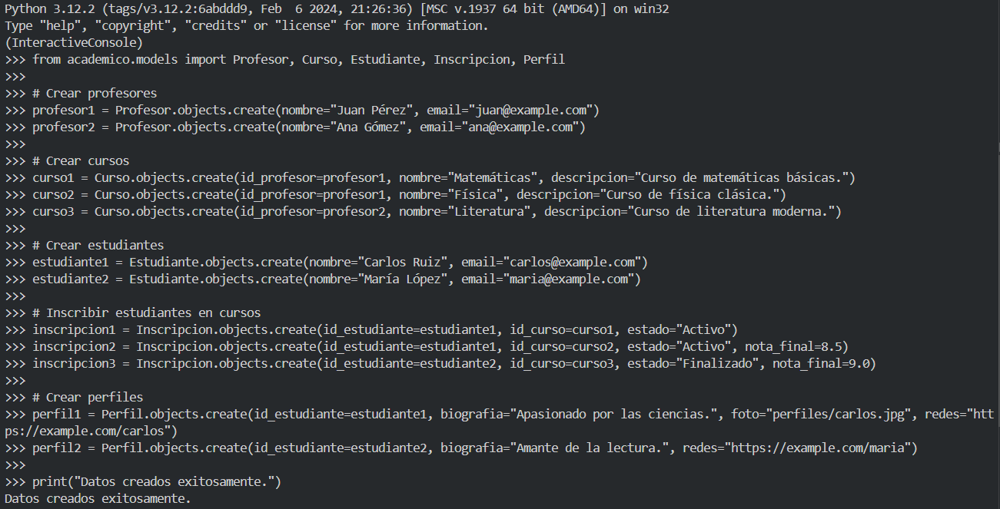
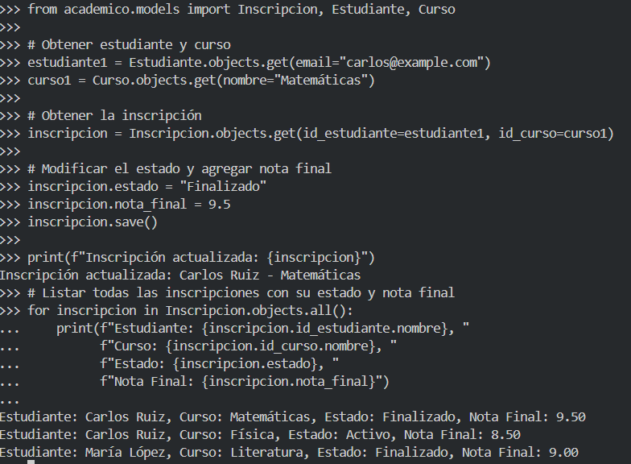
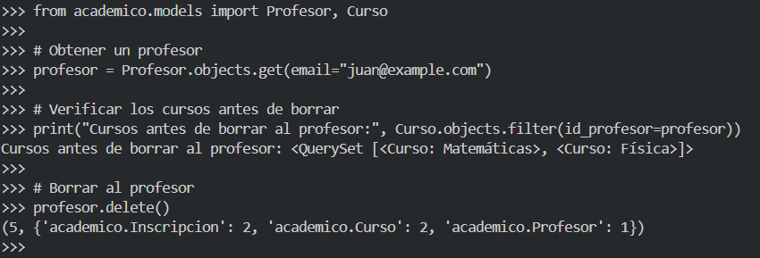
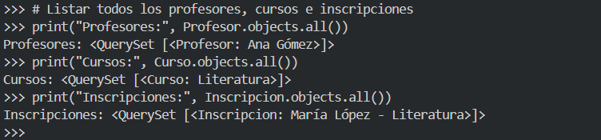

# EJERCICIO M7_AE3

## 1. Análisis del Problema y Entidades
Entidades y Relaciones

Profesores: Tienen una relación "uno a muchos" con Cursos.
Cursos: Tienen una relación "muchos a muchos" con Estudiantes, mediante una entidad intermedia llamada Inscripciones.
Estudiantes: Tienen una relación "uno a uno" con Perfiles.


## 2. Definición del Modelo de Datos en Django
2.1. Relación Muchos a Uno: Profesor y Curso

Un Profesor puede impartir varios Cursos.
Un Curso pertenece a un solo Profesor.
Usaremos ForeignKey con on_delete=models.CASCADE para el borrado en cascada.  

2.2. Relación Muchos a Muchos con Entidad Intermedia: Estudiante y Curso

Los Estudiantes pueden inscribirse en varios Cursos.
Un Curso puede tener múltiples Estudiantes.
La entidad intermedia Inscripcion incluye fecha_inscripcion, estado, y nota_final.  

2.3. Relación Uno a Uno: Estudiante y Perfil

Cada Estudiante tiene un Perfil con información adicional.
Usaremos OneToOneField.

## 3. Implementación en Django

3.1 Creamos un proyecto Django y una aplicación llamada academico.

3.2 Implementamos los modelos en models.py.


```python
from django.db import models

# Relación Muchos a Uno: Profesor y Curso 
# Un Profesor puede impartir varios Cursos.
# Un Curso pertenece a un solo Profesor.

class Profesor(models.Model):
    id = models.AutoField(primary_key=True)
    nombre = models.CharField(max_length=100)
    email = models.EmailField(unique=True)

    def __str__(self):
        return self.nombre

class Curso(models.Model):
    id = models.AutoField(primary_key=True)
    id_profesor = models.ForeignKey(Profesor, on_delete=models.CASCADE) # Borrado en cascada
    nombre = models.CharField(max_length=100)
    descripcion = models.TextField()

    def __str__(self):
        return self.nombre
    
# Relación Muchos a Muchos: Estudiante y Curso
# Un Estudiante puede estar inscrito en varios Cursos.
# Un Curso puede estar inscrito por varios Estudiantes.

class Estudiante(models.Model):
    id = models.AutoField(primary_key=True)
    nombre = models.CharField(max_length=100)
    email = models.EmailField(unique=True)

    def __str__(self):
        return self.nombre

# Entidad Intermedia para la relación Muchos a Muchos
class Inscripcion(models.Model):
    ESTADO_CHOICES = [
        ('Activo', 'Activo'),
        ('Finalizado', 'Finalizado'),
    ]
    id_estudiante = models.ForeignKey(Estudiante, on_delete=models.CASCADE)
    id_curso = models.ForeignKey(Curso, on_delete=models.CASCADE)
    fecha_inscripcion = models.DateField(auto_now_add=True)
    estado = models.CharField(max_length=10, choices=ESTADO_CHOICES, default='Activo')
    nota_final = models.DecimalField(max_digits=5, decimal_places=2, null=True, blank=True)

    def __str__(self):
        return f"{self.id_estudiante} - {self.id_curso}"

# Relación Uno a Uno: Estudiante y Perfil
# Un Estudiante tiene un solo Perfil.
# Un Perfil pertenece a un solo Estudiante.

class Perfil(models.Model):
    id_estudiante = models.OneToOneField(Estudiante, on_delete=models.CASCADE) # implementación con OneToOneField
    biografia = models.TextField(blank=True)
    foto = models.ImageField(upload_to='perfiles/', blank=True, null=True)
    redes = models.URLField(blank=True)

    def __str__(self):
        return f"Perfil de {self.id_estudiante}"

```

3.3 Generamos y aplicamos las migraciones (makemigrations y migrate).

``` bash
python manage.py makemigrations
python manage.py migrate
```

## 4. Validación de Relaciones en la Consola de Django
4.1 Creamos Datos Iniciales



4.2 Modificamos estados de inscripciones y agregamos notas finales.



4.3 Borramos un profesor y sus cursos asociados.



4.4 Comprobamos que el borrado en cascada funciona correctamente.


